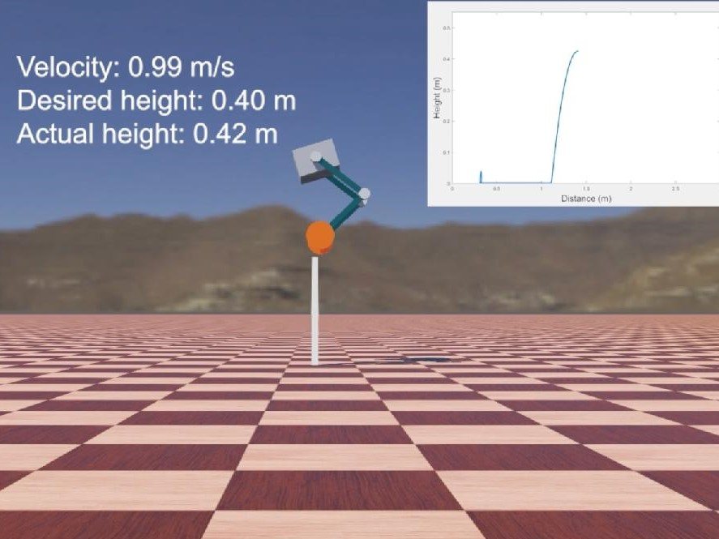

# Introduction



We establish a wheeled-bipedal jumping dynamical (W-JBD) model to optimize the height control, and the Bayesian optimization for torque planning (BOTP) method based on a joint optimization framework for torque planning to achieve accurate height control and minimal energy cost.

# Citation

Y. Zhuang et al., "*Height Control and Optimal Torque Planning for Jumping With Wheeled-Bipedal Robots*," 2021 6th IEEE International Conference on Advanced Robotics and Mechatronics (ICARM), 2021, pp. 477-482, doi: 10.1109/ICARM52023.2021.9536196.

```
@INPROCEEDINGS{9536196,  author={Zhuang, Yulun and Xu, Yuan and Huang, Binxin and Chao, Mandan and Shi, Guowei and Yang, Xin and Zhang, Kuangen and Fu, Chenglong},  booktitle={2021 6th IEEE International Conference on Advanced Robotics and Mechatronics (ICARM)},   title={Height Control and Optimal Torque Planning for Jumping With Wheeled-Bipedal Robots},   year={2021},   pages={477-482},  doi={10.1109/ICARM52023.2021.9536196}}
```

# Dependency

- **Python  3.7**
- [**Webots  R2021a**](https://github.com/cyberbotics/webots)
- [**Advisor 0.1.6**](https://github.com/silvery107/advisor)

This project was tested on Ubuntu 18.04 and Windows 10 while the optimization framework requires Linux.

# Structure

```
├── contrllers
│   ├── my_controller_python
│   ├── ground
│   └── linear
├── advisor_config
│   ├── config.json
│   ├── min_function.py
│   ├── quick_start.md
│   └── sdk.md
├── worlds
│   └── ...
├── utils
│   ├── plot_result.py
│   └── ...
├── README.md
├── requirements.txt
├── robot_specifications.txt
└── ...
```

# Qucik Start

## Simulation Setup
1. Open `<worlds/world_pure.wbt>`
2. Control the robot using keyboard:

	|Motion|Command|
	|-|-|
	|Jump|Space|
	|Forward|W|
	|Backward|S|
	|Left Turn|A|
	|Right Turn|D|
	|Halt Turn|F|
	|Squat Down|↓|
	|Stand Up|↑|

## Optimization Setup
1. Open `<worlds/world_jump.wbt>`
2. Check `<advisor_config/quick_start.md>`, and results can be plotted using `<utils/plot_results.py>`.

# Contributors
SilverSoul, Sure, Penson, Amanda, YZ, Xin Yang


